# Migrate to Open License Conda

## 1. Miniconda => Miniforge

Pinokio's managed Conda runtime now uses Miniforge instead of Miniconda.

Pinokio has relied on a bundled Conda base from the beginning, but the managed base is now built around the conda-forge distribution path and a conda-forge-first package policy.

This changes the foundation of Pinokio's runtime in three important ways:

1. Pinokio no longer depends on Anaconda's Miniconda installer for its managed runtime.
2. Package installs now start from conda-forge, which makes dependency resolution cleaner and more predictable.
3. The managed base can be repaired by reinstalling the Miniforge root instead of carrying forward older Miniconda state.

## 2. Upgrade built-in conda packages

The migration also tightened the runtime package pins that have historically caused install and startup issues:

- Miniforge release: `26.3.2-3`
- Conda: `26.3.2`
- Python: `3.10.20`, including the Windows SSL/certificate build fix
- Node.js: `24.18.0`. Newer projects like voicebox require node.js>24. Now natively supported.
- pnpm: `11.9.0`
- FFmpeg: `8.1.2`
- 7zip on Windows: `23.01`
- uv: `0.11.23`
- huggingface_hub: `1.20.1`


---

# Feature Updates

## 1. Autolaunch

Autolaunch is now a first-class Pinokio feature instead of a hidden environment setting. The release adds a global Autolaunch page, app-level startup controls, launch script selection, dependency-aware startup, and live status plumbing for startup and manual launches.


### 1.1. Autolaunch on Pinokio start

You can make any app automatically launch when pinokio launches, with just 1-click.

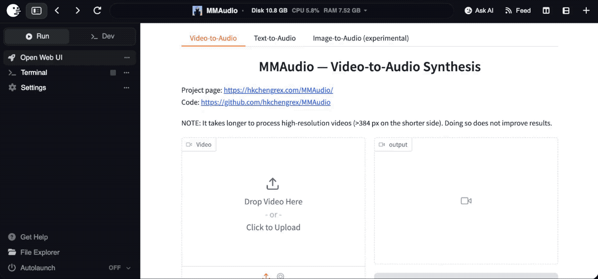

Once you set an app to autolaunch, whenever you restart pinokio, those selected apps will launch along with pinokio:

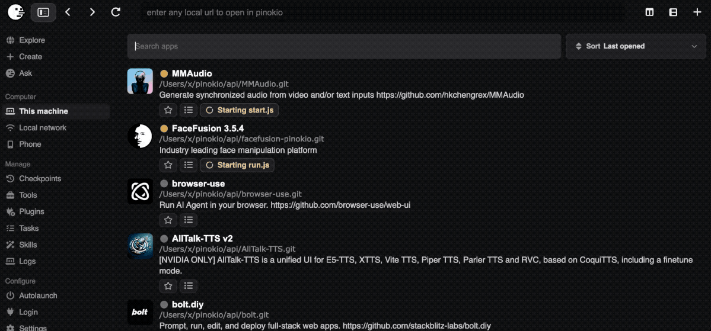

Apps can be configured to start automatically when Pinokio starts. Each app keeps a selected launch script and a separate `Start with Pinokio` switch, so turning startup on or off does not have to erase the configured script.

The startup scheduler reads installed apps, resolves their selected scripts, skips missing scripts, records per-app startup state, and updates Home while startup is still in progress.


### 1.2. Autolaunch management page

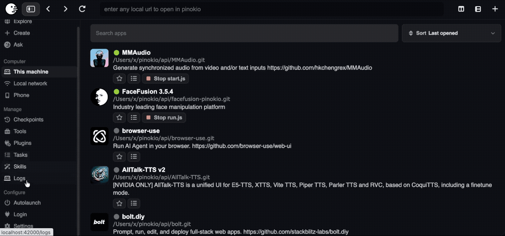


The new `/autolaunch` page lets users search installed apps, pick a launch script, toggle startup, disable startup globally, and manage required apps from a single screen. Enabled apps sort to the top, and the detail panel shows the current script, menu-discovered scripts, local script files, manual relative paths, and requirements.


---

## 2. Orchestration

Automatically launch related apps.

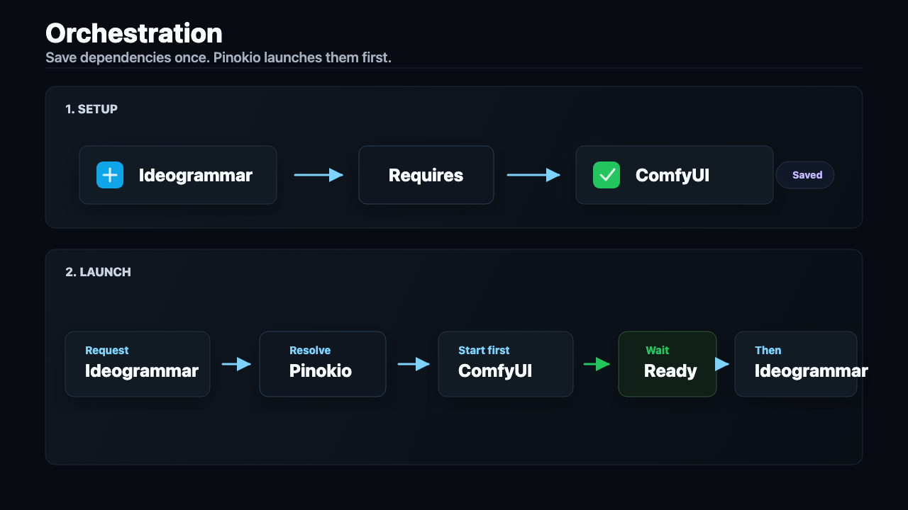

### 2.1. Set dependent apps

Apps can now declare required apps that should launch before the current app by adding dependencies.

For example, let's say an app named **Ideogrammar** requires **ComfyUI** to be running. You can:

1. From Ideogrammar, click "Autolaunch".
2. Click "Add dependency".
3. Add "ComfyUI".

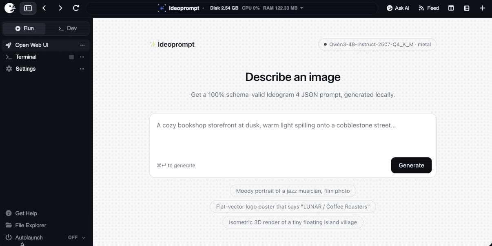

Now whenever you launch Ideogrammar, it will automatically launch ComfyUI and wait for it to be ready, and only when ComfyUI is ready, will it launch Ideogrammar.

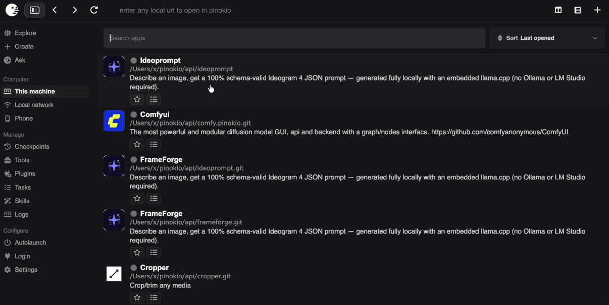

Furthermore, Pinokio resolves those dependencies recursively, which means if:

1. A depends on B
2. B depends on C and D

When you launch A, it will trigger the launch of B, which will trigger the launch of C and D. Once both C and D are ready, B will launch, and once B is ready, A will be launched.

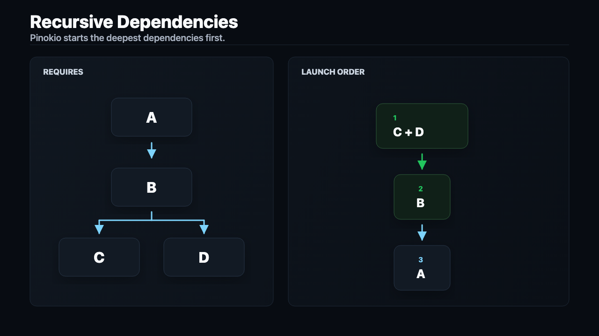


### 2.2. Combine with Autolaunch


This applies to startup autolaunch and to manual app launches, so a complex app stack can be expressed as dependencies instead of relying on users to remember the correct launch order.

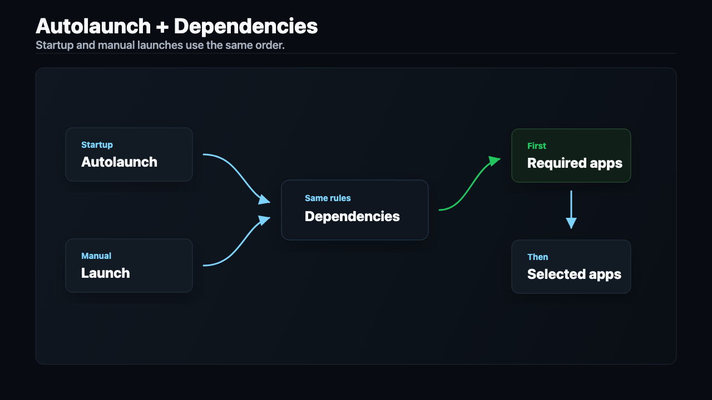

---


## 2. Info bar

App pages now surface live resource usage in the info bar, displaying per-app usage information.

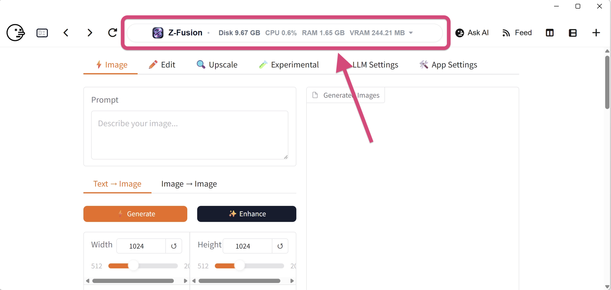

Pinokio tracks:

- Disk usage
- RAM
- CPU
- VRAM

through a runtime service that groups running processes by app workspace and samples platform-specific process and GPU data.

Users can open the resource popover to toggle RAM, VRAM, and CPU display.

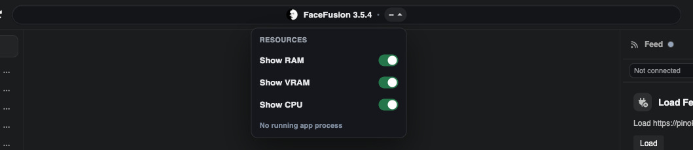

## 3. Help

The old Logs surface has been rebuilt into a "Get Help" workflow. Users can still inspect raw logs, but a workspace-specific view can now build a Markdown issue report from recent app logs, show included files, estimate registry draft size, run privacy review, and hand the report to an AI agent or Pinokio Community.

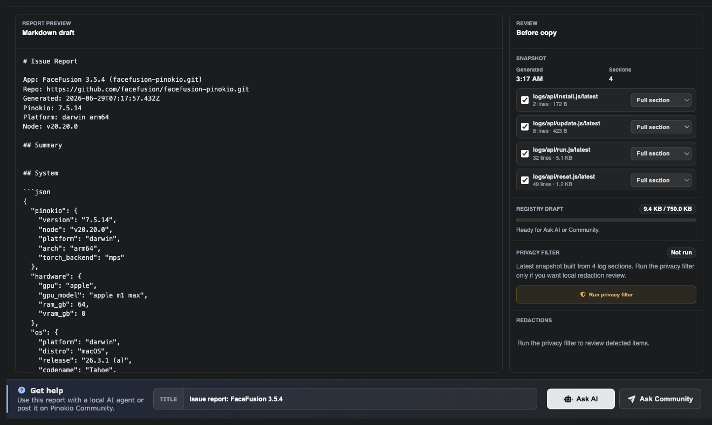

### 3.1. Ask Community

The Help view automatically focuses on the latest execution context when an app workspace is provided. Youc can 1-click post the full logs to the pinokio community to ask for help.

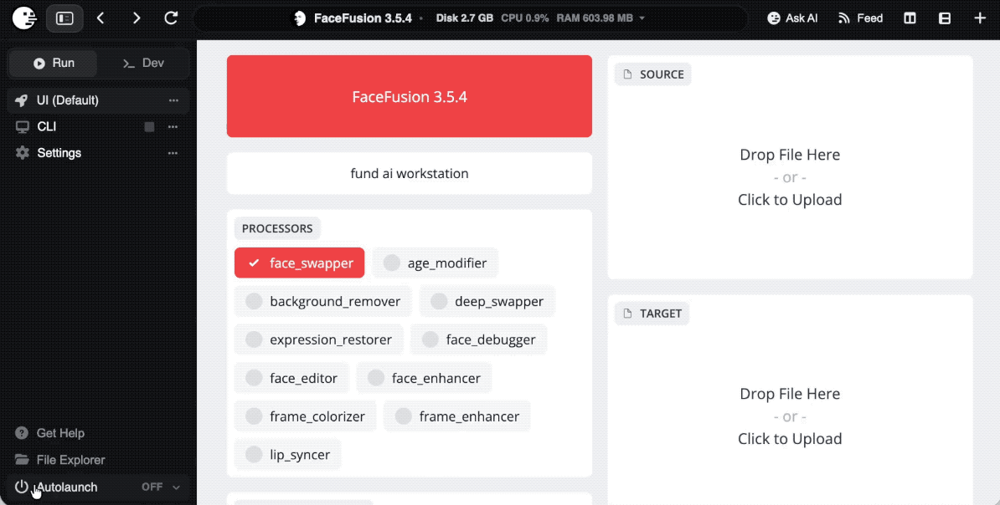

### 3.2. Ask AI

You can also click "Ask AI" to ask your local AI agent to fix the app. The agent knows everything about your app---code, documentation, usage pattern, and actual logs---which means it is very likely to fix whatever problem you have with your apps.

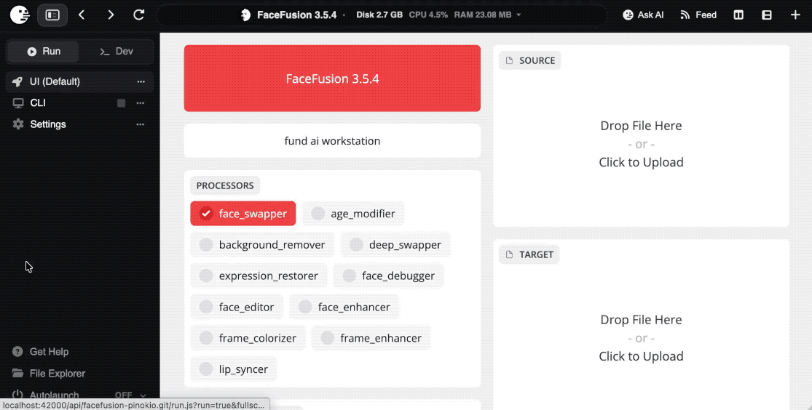


### 3.2. Auto-help

Now Pinokio proactively nudges you to the "Get help" section when there's an error, so you can either post to pinokio community, or ask your AI agent locally.

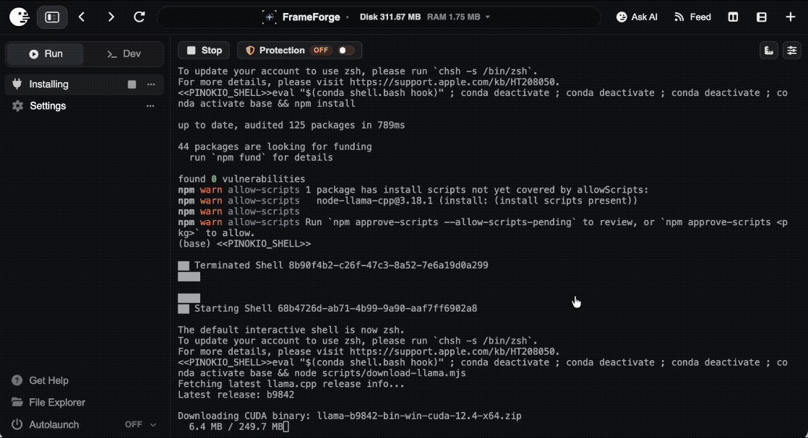

## 4. Use on Phone

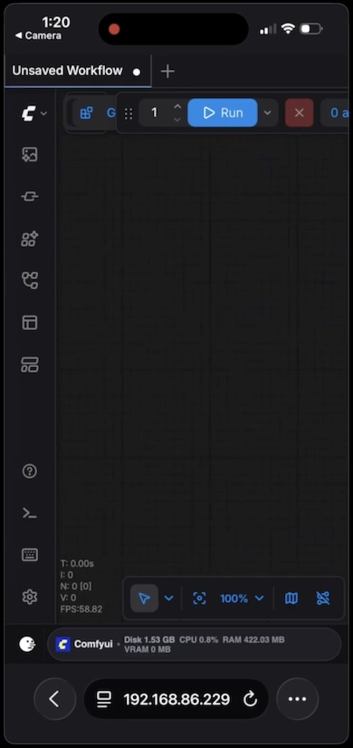

Phone access is now part of the shared sidebar. The Phone button opens a focused local-access panel with a QR code and local URL, and setup is gated when the local network router is not ready.

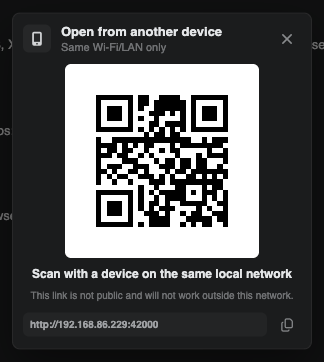

Pinokio's mobile layout was also reworked around the app list. Primary navigation moves to a compact footer, search and sort remain reachable, and app rows keep their key actions available at phone width.

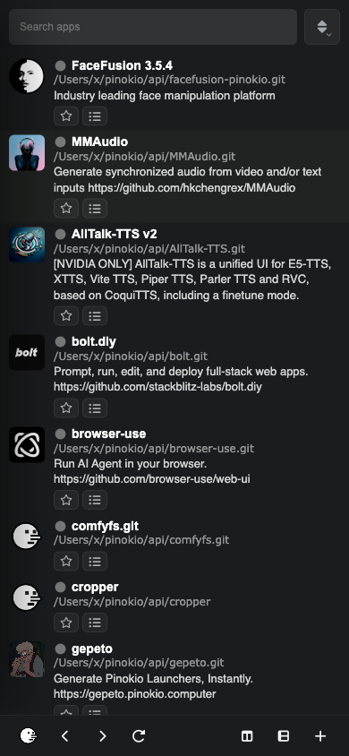

The same phone layout applies inside app workspaces. Running apps keep the mobile drawer, Run/Dev switch, web UI and terminal entries, Ask AI, and live resource status available without needing a desktop-width window.


Dev mode is also usable from a phone. Project shells, terminal agents, and desktop agents load in the compact launcher, and OpenAI Codex Auto can run inside Pinokio's terminal view from the selected workspace.

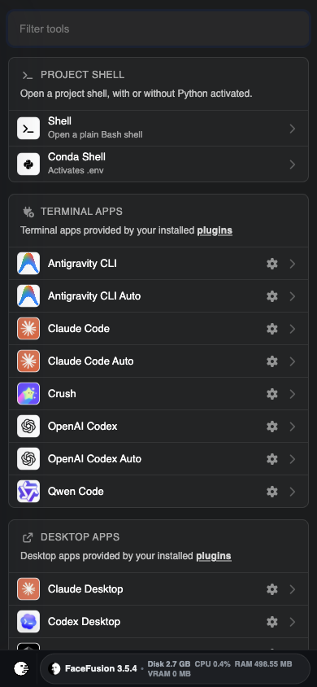

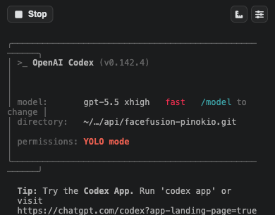

---

# Performance Improvement

## 1. Remove initial file scan

Pinokio no longer pays the old startup cost of recursively scanning every workspace up front. Workspace status is now cached and invalidated when a watcher sees changes, with polling fallback when filesystem watching is unavailable.

Gitignore handling was also moved toward path-scoped evaluation, so status checks can evaluate the paths that matter instead of building one expensive global ignore model before the app is usable.

## 2. Version control optimization

Git repository discovery and status paths were optimized around the active workspace. Pinokio now preserves selected-workspace behavior for git status, diff, browser, delete, move, and terminal-created workspaces while avoiding broad startup scans.

The practical result is less disk activity at launch and faster navigation into git-aware app pages.

## 3. Interactive terminal performance improvement

Input-enabled terminals now batch renderer writes through the browser frame loop. Instead of writing every terminal chunk immediately, Pinokio coalesces output and flushes it on `requestAnimationFrame` or a short fallback timer.

This reduces renderer pressure in busy terminals, especially AI-agent terminals and scripts that emit large amounts of output.

---

# Design Overhaul

Pinokio 8.0.0 brings the main product surfaces into one visual system. Home, app pages, Tools, Plugins, Skills, Logs, Settings, Setup, Network, and auth pages now share the same sidebar language, page shell, compact controls, and task-oriented layout.

## Plugins Page

Plugins now appear as managed tools grouped by how they launch. Terminal plugins run inside Pinokio, while desktop plugins launch externally. Bundled tools such as OpenAI Codex, Claude Code, Antigravity, Qwen Code, VS Code, Cursor, Windsurf, and Codex Desktop are visible from the same page.

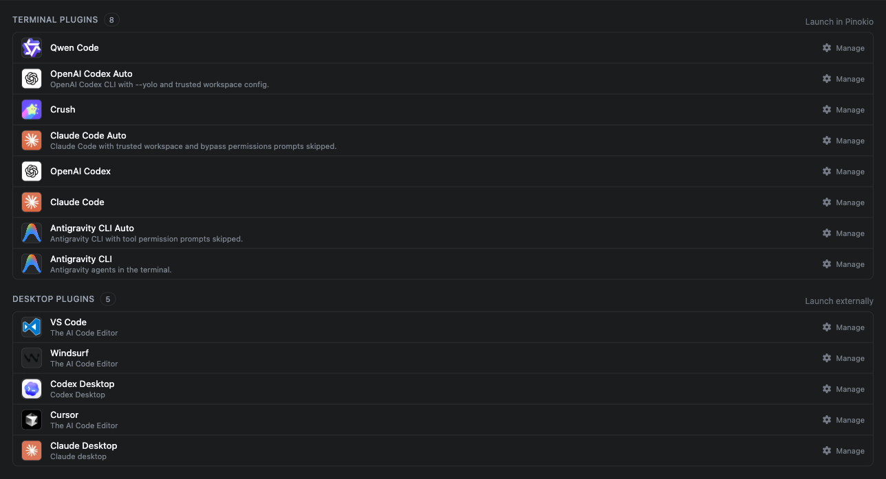

## Universal Sidebar

The shared sidebar now gives Home and management pages a consistent navigation model. It groups primary actions, local machine access, management pages, connected accounts, and system pages without forcing each page to invent its own navigation.

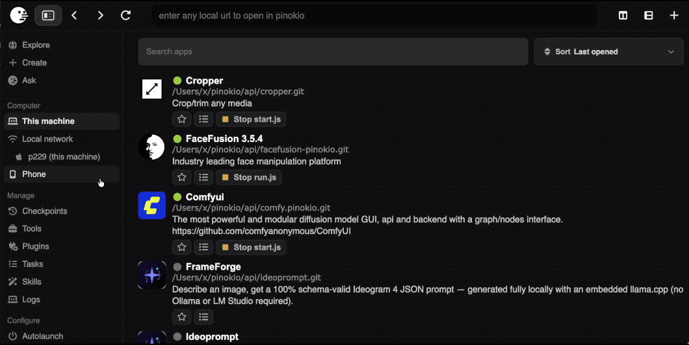

## Context Menu

Home app rows now expose a focused action drawer instead of crowding every command into the row. The drawer groups run actions, dev mode, and file actions while keeping the app identity visible.

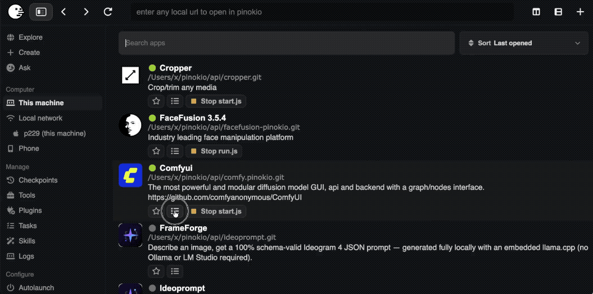


## App page

App pages now use one vertical sidebar. The old horizontal tab mode was removed because it created layout and responsiveness problems. The current page keeps Run and Dev modes in the vertical rail, shows script actions in a compact list, and includes a one-click sidebar toggle for more workspace room.

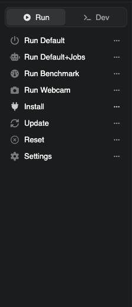

Ask AI was also redesigned as an in-app drawer. Users can search terminal agents, desktop agents, and project shells from the app context, then open the selected agent without leaving the app page.

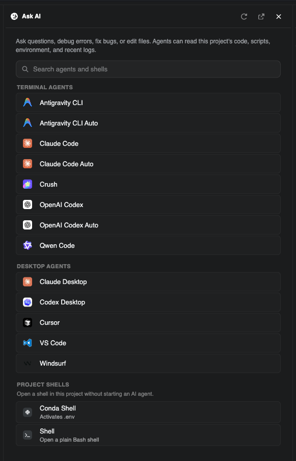

---

# API Updates

Pinokio 8 adds API and template features for the launcher patterns that changed in this release: passing long prompts to local agents, opening native desktop tools from Pinokio, keeping externally launched tools visible in the footer, and routing PyTorch installs by detected hardware.

## `shell.run` Structured Arguments

`shell.run` can now accept structured argv messages with multiline argument values:

```js
{
  method: "shell.run",
  params: {
    message: {
      _: [
        "python",
        "-c",
        "print('line 1')\nprint('line 2')"
      ]
    }
  }
}
```

This matters for AI-agent and help-report flows. A prompt or generated issue report can contain many lines, quotes, and shell-sensitive characters. With structured argv, Pinokio treats each array item as one argument instead of asking a launcher author to hand-escape a shell command.

Practical agent example:

```js
{
  method: "shell.run",
  params: {
    message: {
      _: [
        "npx",
        "-y",
        "@openai/codex@latest",
        "--yolo",
        "-c",
        "projects={ {{JSON.stringify(args.cwd)}}={trust_level=\"trusted\"} }",
        "{{args.prompt || ''}}"
      ]
    },
    path: "{{args.cwd}}",
    input: true
  }
}
```

If a structured argument renders to multiple lines, Pinokio moves it into a generated `PINOKIO_ARG_*` environment variable and references it safely for Bash, PowerShell, or `cmd.exe`. Raw string commands still behave as before. The terminal preview redacts generated `PINOKIO_ARG_*` values into line-count summaries so large prompts do not flood logs.

## `uri.open`

`uri.open` opens a local file URI, web URI, or desktop-app deep link through the operating system.

Syntax:

```js
{
  method: "uri.open",
  params: {
    uri: "scheme://path-or-action",
    params: {
      key: "value"
    }
  }
}
```

`params.uri` is required. `params.params` is optional; Pinokio appends it as query parameters before opening the URI. Arrays become repeated keys, objects are JSON-encoded, existing query strings are preserved, and hash fragments stay at the end.

This enables desktop agent handoff without shell-specific command construction:

```js
{
  method: "uri.open",
  params: {
    uri: "codex://new",
    params: {
      prompt: "{{args.prompt || ''}}",
      path: "{{args.cwd || cwd}}"
    }
  }
}
```

Other desktop tools can use the same pattern:

```js
{
  method: "uri.open",
  params: {
    uri: "windsurf://cascade/newChat",
    params: {
      prompt: "{{args.prompt || ''}}",
      folder: "{{args.cwd || cwd}}"
    }
  }
}
```

## `process.wait`

`process.wait` keeps a Pinokio script active while Pinokio waits for time, a URL, a `wait-on` condition, app presence, or a manual Stop. This is especially useful after `uri.open`, because the desktop app is launched outside the terminal but Pinokio still needs a visible running state and a Stop control.

Common forms:

```js
{ method: "process.wait", params: { sec: 5 } }
{ method: "process.wait", params: { min: 1 } }
{ method: "process.wait", params: { uri: "http://127.0.0.1:8188" } }
{ method: "process.wait", params: { on: { resources: ["tcp:8188"] } } }
{ method: "process.wait", params: { app: "Comfyui", title: "Waiting for ComfyUI" } }
```

If no time or condition is provided, the wait is indefinite and ends when the user stops the script. `title`, `description`, and `message` make the wait show up in the footer:

```js
[
  {
    method: "uri.open",
    params: {
      uri: "claude://code/new",
      params: {
        q: "{{args.prompt || ''}}",
        folder: "{{args.cwd || cwd}}"
      }
    }
  },
  {
    method: "process.wait",
    params: {
      title: "Launched",
      description: "Click Stop when done."
    }
  }
]
```

## `{{gpu_model}}`

Templates now expose the selected primary GPU model as `gpu_model`, such as `nvidia rtx a4500` or `amd radeon rx 7900 xtx`. Pinokio chooses the same primary controller used for `gpu`: NVIDIA first when present, otherwise the highest-VRAM AMD controller, otherwise Apple, otherwise the first detected controller.

Use this when an app needs a model-specific exception, a diagnostics report, or a more precise log message. Do not use `gpu_model` as the main PyTorch install switch; use `torch_backend` for that.

```js
{
  method: "shell.run",
  params: {
    message: "node scripts/print-hardware.js",
    env: {
      PINOKIO_GPU_MODEL: "{{gpu_model || ''}}"
    }
  }
}
```

## `{{torch_backend}}`

Templates now expose `torch_backend`, a PyTorch install-policy value. It can be `cuda`, `mps`, `rocm`, `xpu`, or `cpu`.

This is the main variable launcher authors should use to choose the PyTorch wheel family. It is based on hardware identity and Pinokio policy, not on runtime probes such as checking whether ROCm, `rocminfo`, `hipInfo`, or Torch already happens to be installed.

The AMD case is why this variable matters. PyTorch ROCm support is not just "vendor is AMD". Discrete cards usually expose useful model names, but APU/iGPU systems can report the GPU as a generic `AMD Radeon Graphics`, while the useful model name or codename appears in the CPU brand instead. The launcher should not have to solve that every time.

Pinokio's AMD policy works like this:

- Pinokio selects the strongest AMD controller by VRAM when multiple AMD GPUs are present.
- If the AMD GPU model clearly matches a supported ROCm lane, `torch_backend` becomes `rocm`.
- If the GPU model is the generic `AMD Radeon Graphics`, Pinokio lazily checks the CPU brand for supported APU/iGPU names and codenames.
- If the model does not match the ROCm policy, the launcher should not install ROCm wheels.

The AMD ROCm policy currently recognizes:

- Radeon RX 7600 and newer families, including RX 7600, 7600 XT, 7600M, 7600M XT, RX 7700, RX 7800, RX 7900, RX 9000, and future RX 8xxx/9xxx names.
- Radeon PRO W7700 and newer families, including PRO W7700, W7800, W7900, and future PRO W 8xxx/9xxx names.
- Radeon PRO V710.
- Radeon AI PRO R9600 and R9700 variants, including suffixes such as R9700S.
- Supported APU/iGPU names and codenames: `780M`, `820M`, `880M`, `890M`, `8050S`, `8060S`, `Strix`, `Phoenix`, and `Fire Range`.

Launcher authors can therefore write the simple branch and let Pinokio handle the AMD discrete-GPU versus APU/iGPU naming details:

```js
{
  when: "{{platform !== 'darwin' && torch_backend === 'rocm'}}",
  method: "shell.run",
  params: {
    message: "uv pip install torch torchvision torchaudio --index-url https://download.pytorch.org/whl/rocm6.3"
  }
}
```

## `{{gpu_driver}}`

Templates now expose the selected primary GPU driver version as `gpu_driver`. This is a raw string from the selected controller, commonly something like `565.90` or `580.88`.

Use this when the install choice depends on the NVIDIA driver family. The current practical case is CUDA wheel routing: a `cu130` PyTorch/Triton stack can fail on a machine whose NVIDIA driver only supports CUDA 12.x, so launchers need a conservative fallback.

`Number.parseFloat(gpu_driver || '0') >= 580` means:

- `gpu_driver || '0'`: if the driver is missing or unreadable, treat it as `0`.
- `Number.parseFloat(...)`: convert strings such as `580.88` or `565.90` into comparable numbers.
- `>= 580`: use the CUDA 13 wheel lane only for NVIDIA driver 580 or newer.

The current CUDA wheel routing rules are:

- `torch_backend !== 'cuda'`: do not install a CUDA wheel. Use the `mps`, `rocm`, `xpu`, or `cpu` branch instead.
- `torch_backend === 'cuda'` and `Number.parseFloat(gpu_driver || '0') >= 580`: use `cu130`.
- `torch_backend === 'cuda'` and the driver is missing, unreadable, or below `580`: use `cu128`.

For this release, the new generic NVIDIA launcher rule only adds the `cu130` / `cu128` split. Older tags such as `cu121`, `cu124`, and `cu126` remain app-specific pins and are not part of the new generic routing rule.

Windows NVIDIA example:

```js
{
  when: "{{platform === 'win32' && torch_backend === 'cuda' && Number.parseFloat(gpu_driver || '0') >= 580}}",
  method: "shell.run",
  params: {
    message: "uv pip install torch torchvision torchaudio --index-url https://download.pytorch.org/whl/cu130"
  }
}
```

```js
{
  when: "{{platform === 'win32' && torch_backend === 'cuda' && !(Number.parseFloat(gpu_driver || '0') >= 580)}}",
  method: "shell.run",
  params: {
    message: "uv pip install torch torchvision torchaudio --index-url https://download.pytorch.org/whl/cu128"
  }
}
```

Linux NVIDIA example:

```js
{
  when: "{{platform === 'linux' && torch_backend === 'cuda' && Number.parseFloat(gpu_driver || '0') >= 580}}",
  method: "shell.run",
  params: {
    message: "uv pip install torch torchvision torchaudio --index-url https://download.pytorch.org/whl/cu130"
  }
}
```

```js
{
  when: "{{platform === 'linux' && torch_backend === 'cuda' && !(Number.parseFloat(gpu_driver || '0') >= 580)}}",
  method: "shell.run",
  params: {
    message: "uv pip install torch torchvision torchaudio --index-url https://download.pytorch.org/whl/cu128"
  }
}
```

## `{{gpus}}`

Templates now expose all detected GPU controllers as `gpus`. Each entry includes `name`, `model`, and `driver`.

Use `gpus` for diagnostics, multi-GPU reporting, or advanced app-specific selection. For normal PyTorch installs, prefer the top-level `torch_backend`, `gpu_model`, and `gpu_driver` variables because they already apply Pinokio's primary-controller selection rules.

```js
{
  method: "shell.run",
  params: {
    message: "node scripts/write-hardware-report.js",
    env: {
      PINOKIO_GPU_MODEL: "{{gpu_model || ''}}",
      PINOKIO_GPU_DRIVER: "{{gpu_driver || ''}}",
      PINOKIO_TORCH_BACKEND: "{{torch_backend}}",
      PINOKIO_GPUS: "{{JSON.stringify(gpus || [])}}"
    }
  }
}
```

---

# Bug Fix

## Cache handling

Pinokio now preflights managed cache directories for `TMP`, `TEMP`, `TMPDIR`, `PIP_TMPDIR`, `UV_CACHE_DIR`, and `PIP_CACHE_DIR`. Normal healthy directories are left alone; broken managed directories can be repaired before they turn into confusing package-install failures.

## `pre` syntax

Malformed `pre` or environment metadata no longer crashes preflight or the `/pre/api/:name` page. Invalid app, plugin, and task manifests are routed through content validation so users get a fixable error state instead of a server-side exception.

## `huggingface_hub` fix

The managed Hugging Face runtime is pinned to `huggingface_hub=1.20.1`, and Windows symlink behavior is handled so model downloads avoid the known symlink-related failure mode.

## Python SSL fix

The managed Python base is pinned to `3.10.20`, with the Windows conda-forge build requirement that includes the SSL/certificate fix. This keeps SSL-sensitive package and model downloads from inheriting the older broken base state.

## Homebrew fix

Homebrew install steps now run with `HOMEBREW_NO_ASK=1` so Homebrew does not unexpectedly prompt during Pinokio onboarding. The Xcode command-line tools path also distinguishes between installable states and manual states such as an unaccepted Xcode license.

## UV upgrade

The managed uv module is pinned to `0.11.23`, and install checks compare the installed version instead of treating any old uv binary as good enough.

---

# Misc

## Pin Conda

Pinokio protects its managed Conda base from launcher scripts that try to update Conda or `conda-libmamba-solver`. The base runtime is owned by Pinokio, so apps should not mutate it as part of app installation.

## Plugin

### Native plugin

Native plugins are now bundled under Pinokio's system plugin source instead of being cloned from GitHub at runtime. That makes the core plugin list available immediately and removes a network-dependent bootstrap step.

### Plugin actions as JavaScript functions

Plugin `run`, `install`, `uninstall`, `update`, and `installed` actions can now be JavaScript functions, not only static arrays. This allows plugins to compute actions from current state while still going through Pinokio's validation and install-state APIs.

### Additional plugins

This release adds bundled tool entries for:

- Antigravity CLI
- Antigravity CLI Auto
- OpenAI Codex
- OpenAI Codex Auto
- Codex Desktop
- Claude Code
- Claude Code Auto
- Claude Desktop
- Qwen Code
- Crush
- VS Code
- Cursor
- Windsurf

## Native Login

Hugging Face login now uses a native device-authorization flow inside Pinokio, with clear connection state and provider ownership. GitHub login also moved to a managed Git Credential Manager path so GitHub authentication no longer depends on users typing credentials into a terminal prompt.

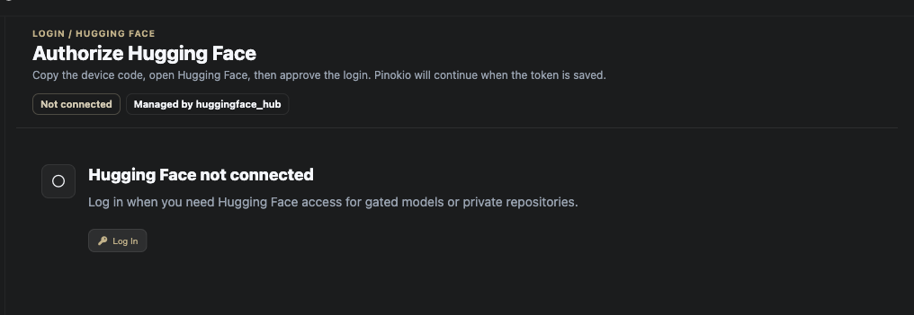

## Manage skills

Pinokio now ships managed skills that can be synced into local agent skill folders. The Skills page shows the source library, sync targets, validity, conflicts, and ON/OFF state for each managed skill. Built-in `pinokio` and `gepeto` skills can be disabled without deleting their source copies, and additional skills can be downloaded from a Git URL.

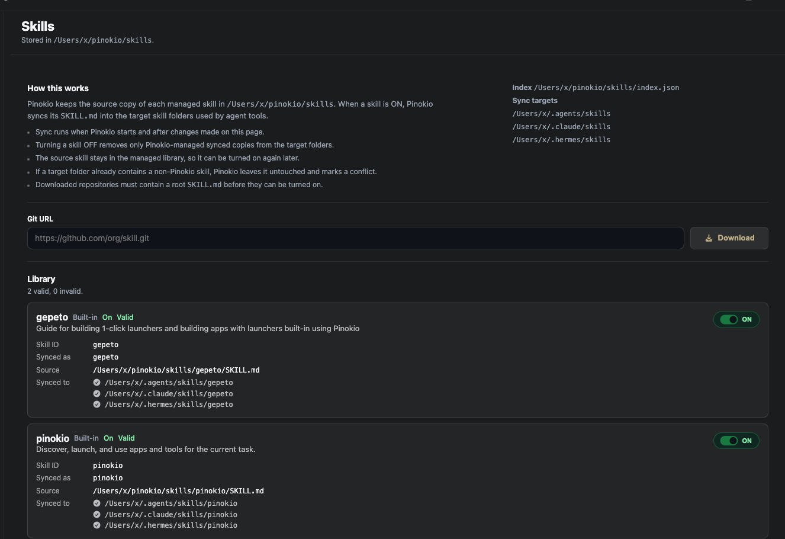
